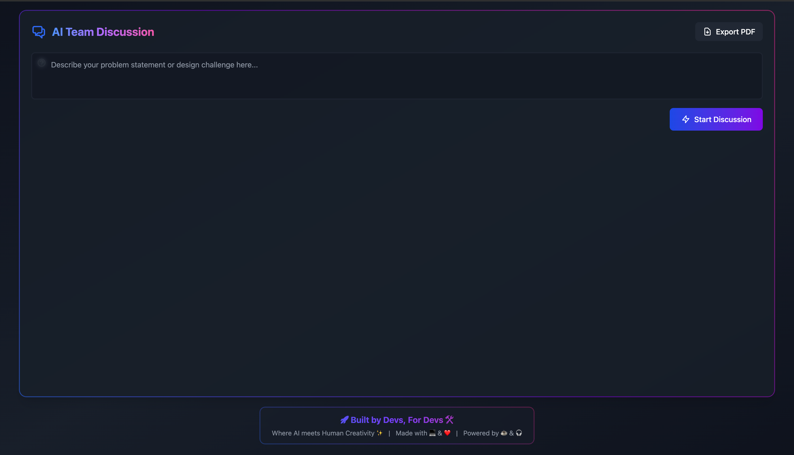

# AI Team Discussion Platform 🤖

An innovative platform that simulates a collaborative team of AI experts working together to solve complex technical problems. Each AI team member has a unique personality, expertise, and perspective.



## Features 🌟

- Real-time collaborative discussion with specialized AI roles:

  - Systems Architect
  - Technical Product Manager
  - Database Engineer
  - Staff Software Engineer
  - Principal Engineer
  - Security Engineer
  - Performance Engineer
  - 100x Intern
  - Unconventional Innovator

- Dynamic response generation based on conversation context
- Interactive WebSocket-based communication
- Export discussions to PDF
- Beautiful dark mode UI with animations
- Role-specific expertise and personality traits
- Consensus-driven problem solving

## Tech Stack 💻

- **Backend**: FastAPI, WebSockets, asyncio
- **AI/ML**: LangChain, Ollama
- **Frontend**: HTML, TailwindCSS, JavaScript
- **Models**: Llama 3.1 (8B parameters)

## Setup 🚀

```bash
# Clone the repository:
git clone https://github.com/AjinkyaTaranekar/AiDevTeam.git
cd AiDevTeam

# Install dependencies
pip install -r requirements.txt

# Run the collaborative problem-solving script
python main.py
```

## 📋 Usage

1. Enter your problem statement or design challenge in the input field
2. Click "Start Discussion" to begin the AI team collaboration
3. Watch as different AI roles contribute their expertise
4. Add your own insights using the side panel
5. Export the final discussion and documentation as PDF

## 🔍 How It Works

1. Initialize the AI team with predefined roles
2. Generate initial perspectives on the problem
3. Conduct multiple collaborative rounds between roles
4. Create a solution collaboration graph
5. Synthesize a comprehensive High-Level and Low-Level Design
6. Generate implementation and resource planning recommendations

## 🚧 Current Limitations

- Requires local Ollama installation
- Experimental AI-driven design generation
- Performance may vary based on the language model used

## 📄 Output

- Generates comprehensive design reports
- Saves detailed markdown reports in `design_reports/`
- Visualizes collaboration network

## 🔗 Related Projects

- Langchain
- Ollama
- NetworkX

## 🌈 Future Roadmap

- [ ] Add more sophisticated role interactions
- [ ] Implement more advanced design validation
- [ ] Create more comprehensive visualization
- [ ] Support additional language models

---

**Disclaimer**: This is an experimental AI-powered tool. Always validate and review AI-generated designs with human expertise.
